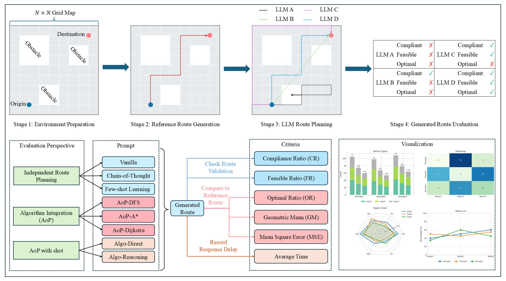

# Absract
Recent advancements in Large Language Models (LLMs) have demonstrated their potential in planning and reasoning tasks, offering a flexible alternative to classical pathfinding algorithms. However, most existing studies focus on LLMs’ independent reasoning capabilities and overlook the potential synergy between LLMs and traditional algorithms. To fill this gap, we propose a comprehensive evaluation benchmark GridRoute to assess how LLMs can take advantage of traditional algorithms. We also propose a novel hybrid prompting technique called Algorithm of Thought (AoT), which introduces traditional algorithms' guidance into prompting. Our benchmark evaluates six LLMs ranging from 7B to 72B parameters across various map sizes, assessing their performance in correctness, optimality, and efficiency in grid environments with varying sizes. Our results show that AoT significantly boosts performance across all model sizes, particularly in larger or more complex environments, suggesting a promising approach to addressing path planning challenges.
## GridRoute Benchmark
You can find the full paper in PDF format here: [GridRoute: A Benchmark for LLM-Based Route Planning with Cardinal Movement in Grid Environments](https://arxiv.org/abs/2505.24306)


## Getting started

```
pip install openai
pip install matplotlib
pip install numpy
pip install pandas
```

## Configuration

### Setting up OpenAI API Key

Before running the experiments, you need to configure your OpenAI API key:

1. Open `src/api_experiment.py`
2. Replace `'YOUR API KEY'` with your actual OpenAI API key:
   ```python
   client = OpenAI(
       api_key='YOUR API KEY'  # Replace with your actual API key
   )
   ```

Alternatively, you can set your API key as an environment variable:
```bash
export OPENAI_API_KEY="your-api-key-here"
```

## Running the Project

The project consists of several components that should be run in sequence:

### 1. Generate Test Data

First, generate the test dataset with various map sizes and obstacles:

```bash
python -m src.data_generation
```

This will create a dataset of maps with obstacles at `./data/dataset.csv`.

#### Customizing the Dataset

You can customize the dataset by modifying the parameters in `src/data_generation.py`:

```python
# Parameters for each map size
map_configs = [
    {"matrix_size": 10, "obstacle_size": 3, "num_obstacles": 2, "num_maps": 100, "num_start_end_pairs": 5},
    {"matrix_size": 20, "obstacle_size": 4, "num_obstacles": 3, "num_maps": 100, "num_start_end_pairs": 5},
    {"matrix_size": 30, "obstacle_size": 5, "num_obstacles": 4, "num_maps": 100, "num_start_end_pairs": 5}
]
```

Parameters explanation:
- `matrix_size`: The size of the grid (e.g., 10×10, 20×20, 30×30)
- `obstacle_size`: The size of each square obstacle
- `num_obstacles`: Number of obstacles to place in each map
- `num_maps`: Number of different maps to generate for each configuration
- `num_start_end_pairs`: Number of start-end point pairs to generate for each map


### 2. Generate Reference Paths

Next, generate reference paths using Dijkstra's algorithm:

```bash
python -m src.reference_paths
```

This will create reference paths at `./data/reference_paths.csv`.

### 3. Run Path Planning Experiments

Run the LLM-based path planning experiments:

```bash
python -m src.api_experiment
```

You can modify the model and prompt template in the script:
```python
model_name = "gpt-4"  # Replace with your desired model
template = "independent"  # Choose from: vanilla, independent, few_shot, algorithm, dijkstra
```

This will save the results to `./results/output_dir/`and named as`{model_name}_{template}.csv`.

### 4. Evaluate the Results

Evaluate the performance of the LLM-based path planning:

```bash
python -m src.Indicator_evaluation
```

This will analyze the results and save metrics to `./results/overall.csv`.

### 5. Visualize the Paths

Generate visualizations of the planned paths:

```bash
python -m src.api_path_drawing
```

This will create path visualizations in `./results/api_planned_paths_figure/`.

### 6. Generate Radar Charts

Create radar charts to compare different models and prompting techniques:

```bash
python -m src.Radar_chart_of_resluts
```

This will generate radar charts in `./results/radar_chart/`.

## Directory Structure
    .
    ├── README.md
    ├── setup.py
    ├── LICENSE
    ├── data/
    │   ├── dataset.csv                
    │   ├── overall.csv                
    │   └── ...                        
    ├── results/
    │   ├── output_dir/                
    │   ├── api_planned_paths/         
    │   └── ...        
    ├── src/
    │   ├── __init__.py
    │   ├── data_generation.py          
    │   ├── api_experiment.py           
    │   ├── api_path_drawing.py         
    │   ├── Indicator_evaluation.py     
    │   └── reference_paths.py          
    ├── prompt.py                       
    └── requirements.txt

## Citation
If you found this work helpful, please consider citing it using the following:
```

```


## License

This project is licensed under the GNU Affero General Public License, version 3 (AGPL-3.0). See the [LICENSE](LICENSE) file for details.